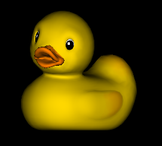
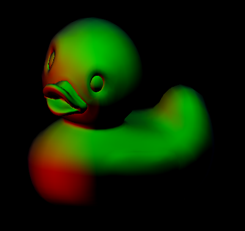
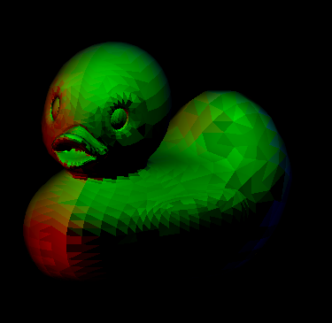
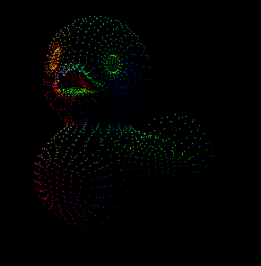
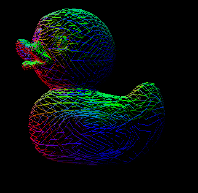
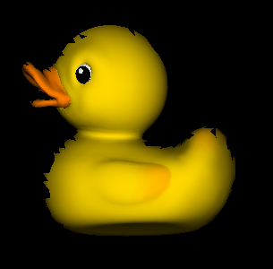
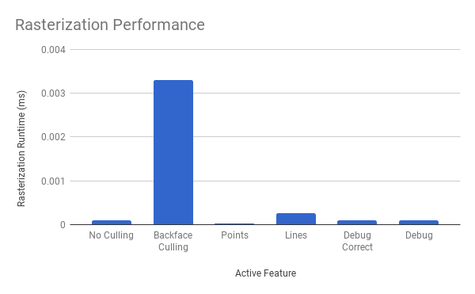

CUDA Rasterizer
===============

**University of Pennsylvania, CIS 565: GPU Programming and Architecture, Project 4**
* Timothy Clancy (clancyt)
* Tested on: Windows 10, i5-4590 @ 3.30GHz 8GB, GTX 970 4GB (Personal)

## Features

*A GPU CUDA Rasterizer featuring model importing, backface culling, multiple types of primitives, and correct barycentric-based coloring.*

|||
|:-:|:-:|
|An example of a rasterized model.|Debug view showing surface normals.|

This implementation features a pipeline with several unique stages, from primitive assembly to rasterization to actual rendering. The primitives supported are triangles, points, and lines with optional debug modes for overriding textures and displaying normal information. The rasterizer includes a simple Lambert shading model for smoother lighting.

### Correct Barycentric Coloring

Every vertex has color or texture information associated with it. In constructing fragments, we can use the information of related vertices to produce better coloring than would be possible if simply coloring per primitive.

|||
|:-:|:-:|
|No barycentric coloring.|With barycentric coloring.|

As demonstrated here, I implemented correct barycentric coloring of primitives. In the uncorrected model, each primitive is colored entirely one shade using the normal information from a single vertex. In the corrected model, the color at any point on a primitive is a smoothed function of the color of all three vertices. This is what results in the overall-smoother appearance to the colors.

### Points and Lines

The ability to toggle display mode to these other primitive types can be useful in better understanding an imported mesh.

|||
|:-:|:-:|
|The duck model drawn with points.|The duck model drawn with lines.|

This example shows that the rasterizer can also display objects as point clouds or wireframes depending on toggle.

### Backface Culling

To improve performance, one can avoid rasterizing the primitives that the user never sees. Anything hidden from the user behind another solid primitive does not need to be drawn. In this case, we want to cull our backfaces from the array of primitives before processing them.

|||
|:-:|:-:|
|The duck with no backface culling.|The scene with backface culling enabled.|

This is implemented by checking the alignment of the camera, which I assume to be along the z-axis, with the surface normal of some given primitive. If the normal is negative, then the primitive is culled. The actual culling uses thrust::partition for stream compaction. As shown in the culled image, this approach is not working spectacularly for me. Some of the faces along the edge of the model are clearly being wrongly culled, leading to the black gaps.

## Performance Analysis

To evaulate the effectiveness of culling, and to measure the impact of various features, I benchmarked the average runtime of a rasterization iteration over a ten second span. Running at 60 frames per second, this represents the average of 600 iterations. All measurements were taken after loading the scene without moving the camera or adjusting the zoom level.

  

Performance across features is fairly consistent. It looks like enabling barycentric color correctness had no performance impact when compared to the flat coloring of primitives. We see a performance improvement over the usual triangle primitives when running with point or line primitives, which is logical since we're rendering less content onto the screen. Instead of scanning through a bounding box, with these strategies we can very efficiently determine exactly what pixels to fill.

Surprisingly, the backface culling had a large, negative impact on performance. This is probably because the scene is not particularly complex--the materials, lighting, and geometry are all very simple. The time spent computing normal directions and performing stream compaction to cull the backfaces is likely a source of overhead greater than the performance cost of naively rendering all primitives. In a far more complex scene I would expect backface culling to be much more important.

### Gallery

|||||||
|:-:|:-:|:-:|:-:|:-:|:-:|
|Keep|your|ducks|in|a|row.|

### Credits

Special thanks goes to these resources.

* [tinygltfloader](https://github.com/syoyo/tinygltfloader) by [@soyoyo](https://github.com/syoyo)
* [glTF Sample Models](https://github.com/KhronosGroup/glTF/blob/master/sampleModels/README.md)
